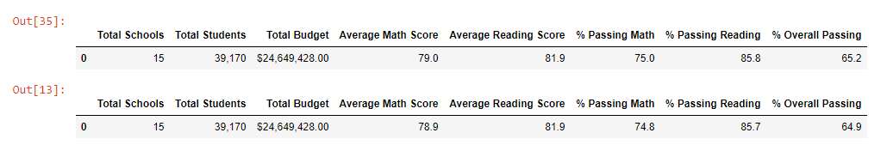
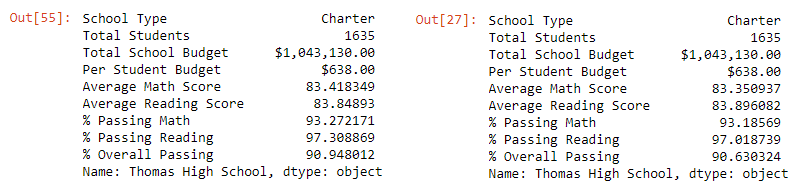
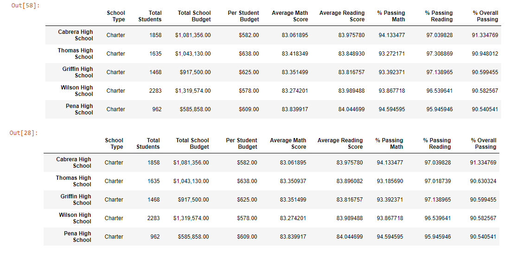
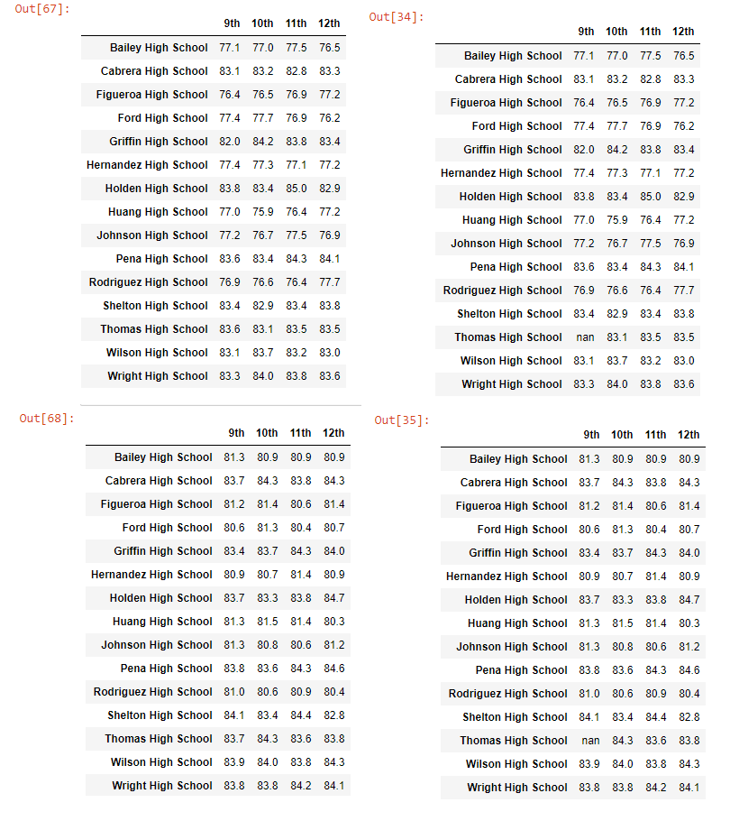
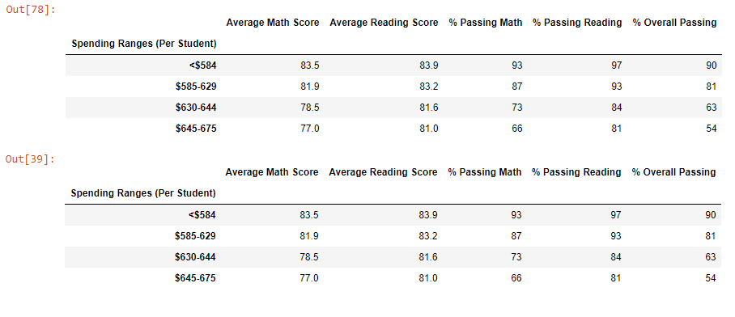
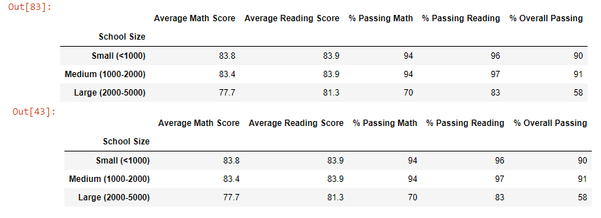
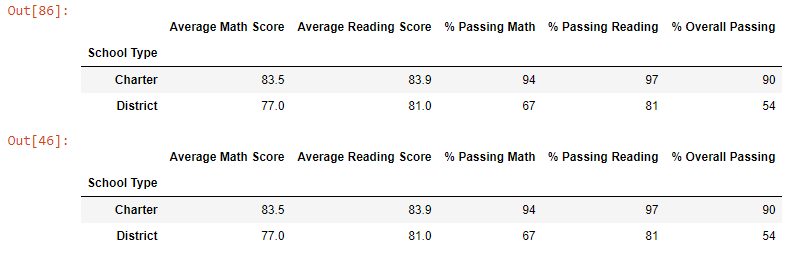

#  PyCitySchools using Pandas: analyzing school performance 
## Overview
Maria is the head data analyst for the school district and wants to analyze the performance of the districts’ schools based on reading and math scores from standardized test taking. The information will be presented to the school board so that they can make decisions about their priorities and fund allocation.  I had previously performed the analysis, but it has come to the attention of school authorities that there was academic dishonesty amongst Thomas High Schools 9th graders. I have been instructed to analyze the data again with these scores omitted. 

## Analysis
The analysis was completed in Jupyter Notebook and used Python 3.7 as well as the numpy and pandas libraries. Raw data was compiled in the schools_complete.csv as well as the students_complete.csv. Student names had to be modified to remove errors. The scores for the 9th graders at Thomas High School were removed by setting the values to nan. The calculations now reflect the omission of those scores. 

## Results
- How is the district summary affected?
   

   **Table 1:** District summary for original analysis (top). Without Thomas High School 9th graders (bottom).  There was minimal affect by removal of Thomas High Schools 9th grade scores.

- How is the school summary affected?

  

   **Table 2:** School summary for Thomas High School in the original analysis (top). Without Thomas High School 9th graders (bottom). Note again the minimal affect of the removal of the 9th grade scores.

- How does replacing the ninth graders’ math and reading scores affect Thomas High School’s performance relative to the other schools?
	 
   **Table 3:** Top five schools by overall passing percentage in the original analysis (top).Without Thomas High School 9th graders (bottom).  Thomas High School’s rank was not affected by the removal of the 9th graders.

- How does replacing the ninth-grade scores affect the following:
  - Math and reading scores by grade
	  - 
	  
	   **Table 4:** School scores across grade levels for math (top tables) and reading (bottom tables) in the original analysis (left tables) and reanalyzed data without Thomas High School 9th graders (right tables).  Thomas High School now has nan for 9th grade reading and math instead of a value.  Other than that, there are no major differences

  - Scores by school spending
     
     **Table 5:** Scores depending on dollars spend per student in the original analysis (top). Without Thomas High School 9th graders (bottom).  There are no major differences.

  - Scores by school size
     
    
    **Table 6:** Scores depending on number of students in a school in the original analysis (top). Without Thomas High School 9th graders (bottom).  There are no major differences.

  - Scores by school type
     
     **Table 7:** Scores depending on whether a school was a district or charter school in the original analysis (top). Without Thomas High School 9th graders (bottom). There are no major differences.

## Summary
Despite the scare of skewed scores from academic dishonesty, removing the 9th grade data from Thomas High School had a very small effect on the analysis. The board can be confident that the decisions made from the original analysis will be adequate. 
